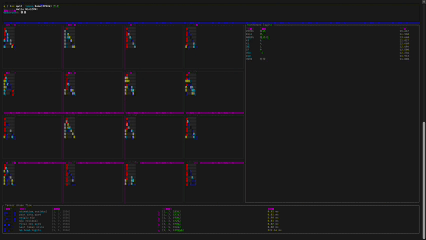

# tiny-llama

A minimal LLaMA-style inference engine for [MiniCPM5-1B](https://huggingface.co/openbmb/MiniCPM5-1B), built purely in Rust.

<p align="center">
  
</p>

I built this project to study the fundamentals of large language models. Every understanding is rephrased directly in the code — dense, but organized. My hope is that it helps you learn too.

Inspired by [tiny-vllm](https://github.com/kuawo/tiny-llm).

## Features

- **CPU-only inference** — no GPU required
- **No KV-cache** — focuses on the core model mechanics
- **Single-file implementation** — `src/main.rs` (~1800 lines)
- **TUI visualization** — real-time view of how the model "thinks"

### What's implemented

| Component            | Details                                                 |
| -------------------- | ------------------------------------------------------- |
| Embedding            | Token ID lookup via embedding table                     |
| RoPE                 | Rotary position embeddings                              |
| Attention            | Multi-head attention with GQA (Grouped Query Attention) |
| MLP                  | SwiGLU activation function                              |
| Normalization        | RMSNorm                                                 |
| Residual connections | Standard skip connections after attention and MLP       |

## Getting Started

### 1. Download the model

```bash
# Download MiniCPM5-1B from HuggingFace
# Put the model files in a directory, e.g. ./models/minicpm5-1b/
# The directory should contain:
#   - config.json
#   - model-00000-of-00001.safetensors
#   - tokenizer.json
```

### 2. Build and run

```bash
cargo run --release -- "<model_dir>" "<your prompt>"
```

Example:

```bash
cargo run --release -- ./models/minicpm5-1b "What is artificial intelligence?"
```

Press `q` to quit early.

## Code Walkthrough

The best way to read this code is top-to-bottom in `src/main.rs`:

1. **Tensor ops** — A minimal `TinyTensor` wrapper over candle tensors with matrix multiply, reshape, transpose, softmax, etc. I will try to write the Maths operations by hand.
2. **Model loading** — `ModelConfigurations`, `LlamaModel`, and `TransformerBlock` structs that map directly to the safetensors keys.
3. **`predict_next_token`** — The inference loop through every transformer layer. Each operation is annotated with shape comments and timing.
4. **TUI** — Ratatui widgets render attention maps, tensor shapes, and logits in real time.

## License

MIT — see [LICENSE](LICENSE)
